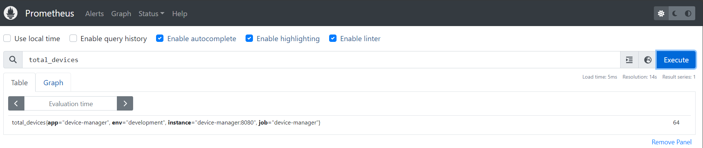
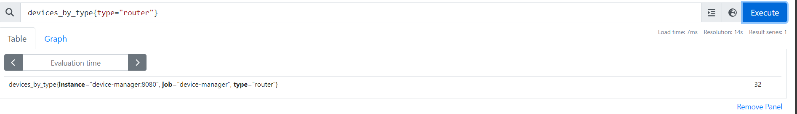
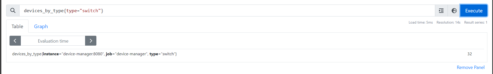
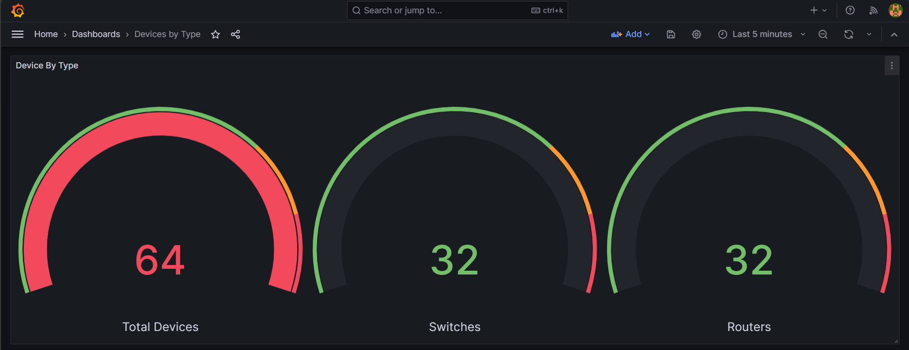

# Custom Metrics for Prometheus and Grafana

## Description

This repository focused on how to create custom metrics for Prometheus.
Also, it contains a Grafana dashboard to visualize the metrics.
This is for learning purposes only and everything is opensource.

## Prerequisites

- Golang 1.20 or higher
- Docker
- Docker Compose
- Redis
- Python 3.6 or higher
- Python pip3
- Grafana and Prometheus

## How to create a custom metrics

1. we have created the golang application that will expose the metrics.
2. it has two metrics: total_devices and device_by_type.
3. Go structure:

   ```
   main.go --> main function
   metrics.go --> metrics functions
       -> var total_devices -> This will be the total number of devices in the database
       -> var device_by_type -> This will be the total number of devices by type in the database like router, switch, etc.
   routes.go --> routes functions
       -> /metrics -> This will be the endpoint to expose the metrics
       -> /devices -> This will be the endpoint to get the devices
       -> /devices/{id} -> This will be the endpoint to get a device by id
   redis.go --> redis functions
       -> var redisClient -> This will be the redis client
       -> func init() -> This will be the function to initialize the redis client
       -> func GetDevices() -> This will be the function to get all devices from the database
       -> func GetDeviceById(id string) -> This will be the function to get a device by id from the database
   ```

4. We created the Dockerfile to build the golang application.
5. We created the docker-compose.yml to run the golang application and redis.
6. We created the Grafana dashboard to visualize the metrics.

## How to run the application

1. Clone the repository:

   ```
   git clone http://github.com/jilanisayyad/DevOps.git
   cd Devops/custom-prom-metrics
   docker-compose up -d
   ```

2. Open the browser and go to <http://localhost:3000> to access Grafana.
3. Login to Grafana with username: admin and password: admin.
4. Go to Configuration -> Data Sources -> Prometheus datasource is already configured.
5. Go to Dashboards -> Manage -> Get Devices Dashboard -> Click on the dashboard.
6. You will see the dashboard with the metrics.
   1. Total Devices: This will be the total number of devices in the database.
   2. Total Number of Router Devices: This will be the total number of router devices in the database.
   3. Total Number of Switch Devices: This will be the total number of switch devices in the database.
7. Go to <http://localhost:8080/metrics> to see the metrics.

   ```
   curl -s http://localhost:8080/metrics | grep device

    devices_by_type{type="router"} 32
    devices_by_type{type="switch"} 32

    total_devices{app="device-manager",env="development"} 64

   ```

8. To generate the multiple devices in the database, run the below command:

   ```
   python3 generate_devices.py
   ```

9. To perform cleanup, run the below command:

   ```
   python3 cleanup-devices.py
   ```

10. To stop the application, run the below command:

    ```
    docker-compose down
    ```

## References

- <https://prometheus.io/docs/guides/go-application/>
- <https://prometheus.io/docs/guides/go-application/#instrumenting>
- <https://prometheus.io/docs/guides/go-application/#metrics>
- <https://prometheus.io/docs/guides/go-application/#exposing-the-metrics>
- <https://prometheus.io/docs/guides/go-application/#running-the-application>

## Image References

Prometheus:

- Total Devices: 
- Total Number of Router Devices: 
- Total Number of Switch Devices: 

Grafana:

- Dashboard: 

## Author Information

- Jilanisayyad <jilani.sayyad@outlook.com>
